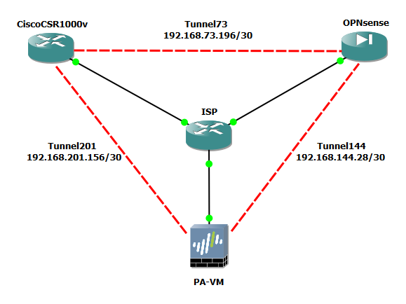

# 🔐 GRE over IPsec Cisco/Palo Alto NGFW/OPNsense

This guide walks you through setting up **GRE over IPsec tunnels** between different firewall and routing platforms:  
- **Cisco IOS Router**  
- **OPNsense Firewall**  
- **Palo Alto Firewall**  

---

## 📑 Table of Contents
1. [Introduction](#introduction)  
2. [Lab Topology](#lab-topology)  
3. [Prerequisites](#prerequisites)  
4. [Configuration Steps](#configuration-steps)
5. [Verification](#verification)  
6. [Troubleshooting](#troubleshooting)  
7. [Author](#author)  

---

## 📝 Introduction
**GRE over IPsec** combines the flexibility of **GRE tunnels** (to transport multiple protocols, enable routing updates, etc.) with the security of **IPsec encryption**.  

In this lab, you will:  
- Build GRE tunnels between Cisco, OPNsense, and Palo Alto devices.  
- Protect GRE traffic with IPsec tunnels.  
- Verify routing and encrypted transport.  

---

## 🗺️ Lab Topology



---

## ⚙️ Prerequisites
- Virtual or physical lab environment  
- Cisco IOS router (e.g., GNS3/EVE-NG)  
- OPNsense VM  
- Palo Alto VM or physical device  
- Basic networking knowledge (IP addressing, routing, VPNs)  

---

## 🔧 Configuration Steps

### Cisco IOS – GRE over IPsec
```shell
crypto ikev2 proposal IKE-PROPOSAL
 encryption aes-gcm-256
 prf sha384
 group 20

crypto ikev2 policy IKE-POLICY
 match address local 198.51.100.87
 proposal IKE-PROPOSAL

crypto ikev2 keyring IKE-KEYRING
 peer OPN
  address 203.0.113.142
  pre-shared-key local IPSec-key
  pre-shared-key remote IPSec-key
 peer PA
  address 192.0.2.76
  pre-shared-key local IPSec-key

crypto ikev2 profile IKE-PROFILE-PSK
 match address local 198.51.100.87
 match identity remote fqdn PSK.OPN
 match identity remote fqdn PSK.PA
 identity local fqdn PSK.CISCO
 authentication remote pre-share
 authentication local pre-share
 keyring local IKE-KEYRING
 
crypto ipsec transform-set TRS esp-gcm 256
 mode tunnel
 
crypto ipsec profile CIP-PSK
 set transform-set TRS
 set pfs group20
 set ikev2-profile IKE-PROFILE-PSK

interface Tunnel73
 description NIP to OPN
 ip address 192.168.73.197 255.255.255.252
 tunnel source 198.51.100.87
 tunnel destination 203.0.113.142
 tunnel protection ipsec profile CIP-PSK

interface Tunnel201
 description NIP to PA
 ip address 192.168.201.157 255.255.255.252
 tunnel source 198.51.100.87
 tunnel destination 192.0.2.76
 tunnel protection ipsec profile CIP-PSK
```

---

### OPNsense – GRE over IPsec
1. **Phase 1 (VPN > IPsec > Pre-Shared Keys > Add)**
   - Local Identifier: `PSK.OPN`
   - Remote Identifier: `PSK.CISCO`
   - Pre-Shared Key: `IPsec-key`
   - Type: `PSK`
2. **Phase 1 (VPN > IPsec > Connections)**  
   - Proposal: `aes256gcm16-sha384-ecp384 [DH20, NIST EC]` 
   - Version: `IKEv2` 
   - Local addresses: `203.0.113.142` 
   - Remote addresses: `198.51.100.87` (Cisco)  
   - Description: `CISCO`
3. **Phase 1 (VPN > IPsec > Connections > CISCO > Local Authentication)** 
   - Authentication: `Pre-Shared Key` 
   - Id: `PSK.OPN` 
4. **Phase 1 (VPN > IPsec > Connections > CISCO > Remote Authentication)** 
   - Authentication: `Pre-Shared Key` 
   - Id: `PSK.CISCO` 
5. **Phase 2 (VPN > IPsec > Connections > CISCO > Children)**  
   - Mode: `Tunnel`
   - Policies: ✅
   - ESP proposal: `aes256gcm16-sha384-ecp384 [DH20, NIST EC]` 
6. **GRE Setup (Interfaces > Devices > GRE)**  
   - Local Address: `203.0.113.142`  
   - Remote Address: `198.51.100.87`  
   - Tunnel local address: `192.168.73.198`
   - Tunnel remote address: `192.168.73.197`
   - Tunnel netmask / prefix: `30`
7. **GRE Setup (Interfaces > Assignments > GRE)**  
   - Enable: ✅

Repeat all steps for the Palo Alto NGFW peer. Make sure to adjust addresses, IDs, and any other parameters accordingly.

**Remember to create the appropriate firewall rules.**
When configuring GRE over IPsec, it is essential to ensure that your firewall allows the required traffic. At minimum, you should permit:

- **IPsec traffic** (UDP/500 for IKE, UDP/4500 for NAT-T, and ESP protocol if applicable).
- **GRE protocol** (IP protocol 47) between the tunnel endpoints.

Without these rules, the tunnel may establish partially or fail to pass GRE-encapsulated traffic.

---

### Palo Alto – GRE over IPsec
1. **IKE Crypto Profile (Network > Network Profiles > IKE Crypto)**
   - Name: `IKE-PROPOSAL`
   - DH GROUP: `group20`
   - ENCRYPTION: `aes-256-gcm`
   - AUTHENTICATION: `none`
2. **IPSec Crypto Profile (Network > Network Profiles > IPSec Crypto)**
   - Name: `CIP-PSK`
   - IPSec Protocol: `ESP`
   - DH Group: `group20`
   - ENCRYPTION: `aes-256-gcm`
   - AUTHENTICATION: `none`
3. **IKE Gateway (Network > Network Profiles > IKE Gateways)**  
   - Name: `CISCO`
   - Version: `IKEv2 only mode` 
   - Local IP: `192.0.2.76`  
   - Peer IP: `198.51.100.87` 
   - Authentication: `Pre-Shared Key` 
   - Pre-shared Key: `IPSec-key`
   - Local Identification: `FQDN (hostname)` `PSK.PA`
   - Remote Identification: `FQDN (hostname)` `PSK.CISCO`
4. **IKE Gateway (Network > Network Profiles > IKE Gateways > CISCO > Advanced Options)**  
   - IKE Crypto Profile: `IKE-PROPOSAL`
5. **Tunnel (Network > Interfaces > Tunnel)**  
   - Create `tunnel.201`  
   - Assign IP: `192.168.201.158/30` 
6. **IPsec Tunnel (Network > IPsec Tunnels)**  
   - Name: `CISCO`
   - Tunnel Interface: `tunnel.201`
   - Type: `Auto Key`
   - Address Type: `IPv4`
   - IKE Gateway: `CISCO`
   - IPSec Crypto Profile: `CIP-PSK`
   - Show Advanced Options: ✅
   - Enable Replay Protection: ✅
   - Add GRE Encapsulation: ✅

Repeat all steps for the OPNsense peer. Make sure to adjust addresses, IDs, and any other parameters accordingly.

**Remember to create the appropriate firewall rules.**
When configuring GRE over IPsec, it is essential to ensure that your firewall allows the required traffic. At minimum, you should permit:

- **IPsec traffic** (UDP/500 for IKE, UDP/4500 for NAT-T, and ESP protocol if applicable).
- **GRE protocol** (IP protocol 47) between the tunnel endpoints.

Without these rules, the tunnel may establish partially or fail to pass GRE-encapsulated traffic.

---

## ✅ Verification
- On Cisco:  
  ```shell
  show crypto ikev2 sa
  show crypto ipsec sa
  ping 192.168.73.198 source 192.168.73.197
  ping 192.168.201.158 source 192.168.201.157
  ```
  
- On OPNsense:  
  - VPN > IPsec > Status Overview → should show an **established SA** in Phase 2 
  - `ping -S 192.168.73.198 192.168.73.197`  
  - `ping -S 192.168.144.29 192.168.144.30`
  
- On Palo Alto:  
  - Monitor > IPsec → should show green  
  - `ping source 192.168.144.30 host 192.168.144.29`  
  - `ping source 192.168.201.158 host 192.168.201.157`  

---

## 🐞 Troubleshooting
- **Tunnel up but no ping** → Check firewall rules on OPNsense / Palo Alto  
- **Routing issues** → Add static routes or enable OSPF/BGP inside GRE  

---

## 👤 Author
**Przemyslaw Pradela**  
- 💼 GitHub: [@ppradela](https://github.com/ppradela)  
- ✉️ Email: [przemyslaw.pradela@gmail.com](mailto:przemyslaw.pradela@gmail.com?subject=GRE%20over%20IPSec%20%20Guide)

---
