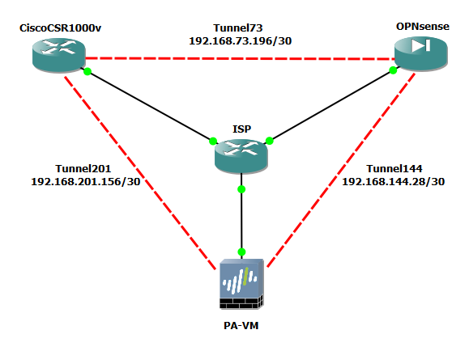

# GRE over IPsec — Cisco / OPNsense / Palo Alto Multivendor Lab

> **Step-by-step configuration guide for GRE over IPsec tunnels across three different network platforms. Built from a real lab deployment — no comparable multivendor guide exists in one place.**


---

## Why GRE over IPsec?

**IPsec alone** encrypts traffic but only between two endpoints — it cannot carry routing protocols (OSPF, BGP) or multicast.
**GRE alone** tunnels arbitrary protocols but provides no encryption.
**GRE over IPsec** combines both: GRE provides the flexible transport layer, IPsec provides the encryption wrapper.

This lab demonstrates a full mesh of GRE tunnels protected by IKEv2/IPsec between a Cisco IOS router, an OPNsense firewall, and a Palo Alto NGFW.

---

## Lab Topology



### Address Plan

| Device | Public IP | Tunnel to Cisco | Tunnel to OPNsense | Tunnel to Palo Alto |
|---|---|---|---|---|
| Cisco IOS | `198.51.100.87` | — | `192.168.73.197/30` | `192.168.201.157/30` |
| OPNsense | `203.0.113.142` | `192.168.73.198/30` | — | `192.168.144.29/30` |
| Palo Alto | `192.0.2.76` | `192.168.201.158/30` | `192.168.144.30/30` | — |

### IKEv2 Parameters

| Parameter | Value |
|---|---|
| IKE Encryption | AES-256-GCM |
| PRF | SHA-384 |
| DH Group | Group 20 (NIST P-384) |
| Authentication | Pre-Shared Key |
| Identity type | FQDN |
| ESP Encryption | AES-256-GCM |
| PFS | Group 20 |

---

## Prerequisites

- Virtual or physical lab environment (GNS3 / EVE-NG / bare metal)
- Cisco IOS router with IKEv2 support
- OPNsense VM
- Palo Alto VM or physical device
- Routable public IPs between all three peers (or simulated WAN in the lab)

---

## Step 1 — Cisco IOS Configuration

Cisco uses `tunnel protection ipsec profile` to bind IPsec to GRE tunnel interfaces. A single IKEv2 profile and IPsec profile covers both peers.

```shell
crypto ikev2 proposal IKE-PROPOSAL
 encryption aes-gcm-256
 prf sha384
 group 20

crypto ikev2 policy IKE-POLICY
 match address local 198.51.100.87
 proposal IKE-PROPOSAL

crypto ikev2 keyring IKE-KEYRING
 peer OPN
  address 203.0.113.142
  pre-shared-key local IPSec-key
  pre-shared-key remote IPSec-key
 peer PA
  address 192.0.2.76
  pre-shared-key local IPSec-key
  pre-shared-key remote IPSec-key

crypto ikev2 profile IKE-PROFILE-PSK
 match address local 198.51.100.87
 match identity remote fqdn PSK.OPN
 match identity remote fqdn PSK.PA
 identity local fqdn PSK.CISCO
 authentication remote pre-share
 authentication local pre-share
 keyring local IKE-KEYRING

crypto ipsec transform-set TRS esp-gcm 256
 mode tunnel

crypto ipsec profile CIP-PSK
 set transform-set TRS
 set pfs group20
 set ikev2-profile IKE-PROFILE-PSK

interface Tunnel73
 description GRE to OPNsense
 ip address 192.168.73.197 255.255.255.252
 tunnel source 198.51.100.87
 tunnel destination 203.0.113.142
 tunnel protection ipsec profile CIP-PSK

interface Tunnel201
 description GRE to Palo Alto
 ip address 192.168.201.157 255.255.255.252
 tunnel source 198.51.100.87
 tunnel destination 192.0.2.76
 tunnel protection ipsec profile CIP-PSK
```

> Both tunnel interfaces share the same IPsec profile. Cisco matches the correct peer from the keyring based on the destination IP of the GRE tunnel.

---

## Step 2 — OPNsense Configuration

OPNsense uses the IKEv2 connections model (strongSwan). GRE is configured separately as a virtual interface on top of the IPsec transport.

### IPsec — Cisco Peer

1. **Pre-Shared Keys** (`VPN → IPsec → Pre-Shared Keys → Add`)
   - Identifier: `PSK.OPN`
   - Remote Identifier: `PSK.CISCO`
   - Pre-Shared Key: `IPSec-key`
   - Type: `PSK`

2. **Phase 1** (`VPN → IPsec → Connections → Add`)
   - Description: `CISCO`
   - Version: `IKEv2`
   - Local addresses: `203.0.113.142`
   - Remote addresses: `198.51.100.87`
   - Proposal: `aes256gcm16-sha384-ecp384`

3. **Local Authentication** (`Connections → CISCO → Local Authentication`)
   - Method: `Pre-Shared Key`
   - ID: `PSK.OPN`

4. **Remote Authentication** (`Connections → CISCO → Remote Authentication`)
   - Method: `Pre-Shared Key`
   - ID: `PSK.CISCO`

5. **Phase 2 / Child SA** (`Connections → CISCO → Children → Add`)
   - Mode: `Tunnel`
   - Policies: ✅ enabled
   - ESP Proposal: `aes256gcm16-sha384-ecp384`

### GRE Interface — Cisco Peer

6. **GRE Device** (`Interfaces → Devices → GRE → Add`)
   - Local Address: `203.0.113.142`
   - Remote Address: `198.51.100.87`
   - Tunnel local address: `192.168.73.198`
   - Tunnel remote address: `192.168.73.197`
   - Tunnel prefix length: `30`

7. **Interface Assignment** (`Interfaces → Assignments`)
   - Assign the GRE device and enable it

Repeat Steps 1–7 for the Palo Alto peer, adjusting addresses to `192.0.2.76` / `PSK.PA`, tunnel addresses `192.168.144.29/30`, and IDs accordingly.

### Firewall Rules

At minimum, allow the following on the WAN interface:

| Protocol | Port / Number | Purpose |
|---|---|---|
| UDP | 500 | IKE negotiation |
| UDP | 4500 | IKE NAT-T |
| IP | 50 (ESP) | IPsec data |
| IP | 47 (GRE) | GRE encapsulation |

---

## Step 3 — Palo Alto Configuration

Palo Alto natively supports GRE encapsulation inside IPsec tunnels — no separate GRE interface is needed.

### IKE and IPsec Crypto Profiles

1. **IKE Crypto Profile** (`Network → Network Profiles → IKE Crypto → Add`)
   - Name: `IKE-PROPOSAL`
   - DH Group: `group20`
   - Encryption: `aes-256-gcm`
   - Authentication: `none` (implicit with GCM)

2. **IPsec Crypto Profile** (`Network → Network Profiles → IPSec Crypto → Add`)
   - Name: `CIP-PSK`
   - Protocol: `ESP`
   - DH Group: `group20`
   - Encryption: `aes-256-gcm`
   - Authentication: `none`

### IKE Gateway — Cisco Peer

3. **IKE Gateway** (`Network → IKE Gateways → Add`)
   - Name: `CISCO`
   - Version: `IKEv2 only mode`
   - Local IP: `192.0.2.76`
   - Peer IP: `198.51.100.87`
   - Authentication: `Pre-Shared Key` — `IPSec-key`
   - Local ID: `FQDN` — `PSK.PA`
   - Remote ID: `FQDN` — `PSK.CISCO`

4. **Advanced Options** (`IKE Gateways → CISCO → Advanced`)
   - IKE Crypto Profile: `IKE-PROPOSAL`

### Tunnel Interface and IPsec Tunnel

5. **Tunnel Interface** (`Network → Interfaces → Tunnel → Add`)
   - Name: `tunnel.201`
   - IP: `192.168.201.158/30`

6. **IPsec Tunnel** (`Network → IPsec Tunnels → Add`)
   - Name: `CISCO`
   - Tunnel Interface: `tunnel.201`
   - Type: `Auto Key`
   - IKE Gateway: `CISCO`
   - IPsec Crypto Profile: `CIP-PSK`
   - Enable Replay Protection: ✅
   - **Add GRE Encapsulation: ✅**

Repeat Steps 3–6 for the OPNsense peer. Adjust addresses to `203.0.113.142` / `PSK.OPN`, create `tunnel.73` with `192.168.144.30/30`.

### Firewall Rules

Allow the same traffic as OPNsense (UDP/500, UDP/4500, ESP, GRE) on the untrust zone.

---

## Verification

### Cisco

```shell
show crypto ikev2 sa
show crypto ipsec sa

! Ping across GRE tunnels
ping 192.168.73.198 source 192.168.73.197
ping 192.168.201.158 source 192.168.201.157
```

### OPNsense

```shell
# VPN → IPsec → Status Overview → Phase 2 should show "established"

ping -S 192.168.73.198 192.168.73.197
ping -S 192.168.144.29 192.168.144.30
```

### Palo Alto

```shell
# Network → IPsec Tunnels → status indicators should be green

ping source 192.168.201.158 host 192.168.201.157
ping source 192.168.144.30 host 192.168.144.29
```

---

## Troubleshooting

| Symptom | Likely Cause | Fix |
|---|---|---|
| IKEv2 SA not establishing | FQDN identity mismatch | Verify `match identity remote fqdn` on Cisco matches the remote FQDN exactly |
| Phase 1 up, Phase 2 fails | Crypto proposal mismatch | Align ESP proposals across both sides |
| Tunnel up, ping fails | Firewall blocking GRE (IP/47) | Add permit rule for protocol 47 between tunnel endpoints |
| Routing not working | No routes over GRE | Add static routes or configure OSPF/BGP inside the GRE tunnel |
| OPNsense GRE not passing traffic | GRE interface not assigned | Confirm the GRE device is assigned and enabled under Interfaces |

---

## Security Notes

- **FQDN-based peer identity** — avoids IP-based matching, which can be spoofed if the WAN IP changes
- **AES-256-GCM** — authenticated encryption, no separate HMAC needed; `authentication: none` is correct for GCM modes
- **DH Group 20 (NIST P-384)** — provides 192-bit security level for key exchange
- **PFS enabled** — each IPsec SA uses an independent DH exchange; compromise of one SA does not expose others
- **Pre-shared keys** — sufficient for lab use; replace with PKI (certificates) for production deployments

---

## License

MIT — free to use, modify, and distribute.

---

## Author

**Przemysław Pradela**

Built from a real multivendor lab deployment.

[](https://github.com/ppradela)
[](https://www.linkedin.com/in/przemyslaw-pradela)
[](https://pradela.ovh)

Contributions and issue reports welcome.
